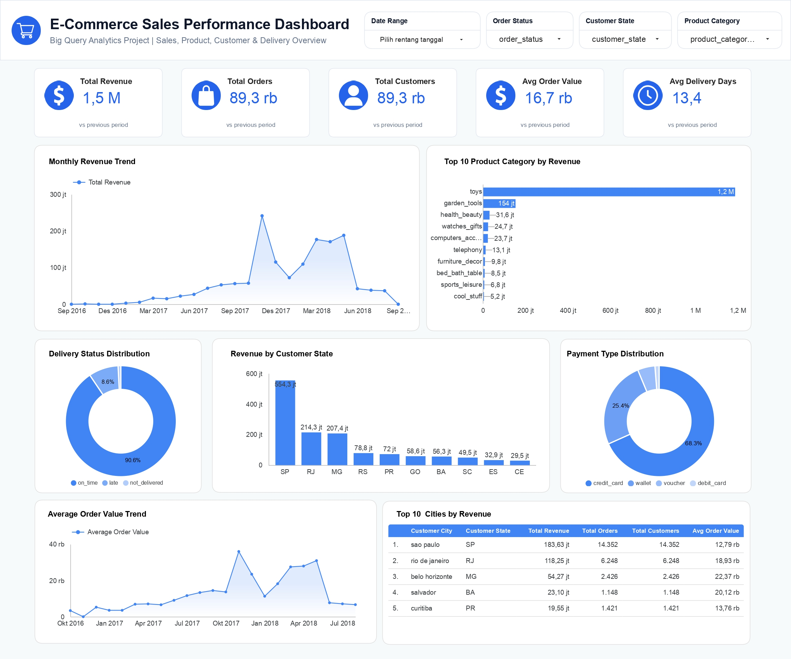

# E-Commerce Sales Performance Dashboard

## Project Overview

This project analyzes e-commerce sales performance using **Google BigQuery** as the data warehouse and **Looker Studio** as the dashboard visualization tool. The analysis focuses on revenue performance, order volume, customer location, product category contribution, payment behavior, delivery performance, and Average Order Value (AOV).

The project follows a simple analytics workflow from raw data ingestion to cleaned staging tables, analytical mart tables, dashboard-ready views, and business insights.

---

## Objectives

The main objectives of this project are to:

- Build an end-to-end sales analytics workflow using BigQuery and SQL.
- Transform raw e-commerce data into clean and dashboard-ready tables.
- Create an interactive Looker Studio dashboard for business performance monitoring.
- Analyze key business metrics such as revenue, orders, customers, AOV, payment method, product category performance, and delivery status.
- Generate actionable business insights and recommendations based on the analysis.

---

## Tools Used

- **Google BigQuery** — data warehouse, SQL transformation, data mart creation
- **Looker Studio** — dashboard visualization and interactive reporting
- **SQL** — data cleaning, transformation, aggregation, validation
- **Kaggle Dataset** — e-commerce order and supply chain dataset
- **GitHub** — project documentation and portfolio repository

---

## Dataset

The dataset used in this project is an e-commerce order dataset obtained from Kaggle. The analysis uses five main tables:

| Table | Description |
|---|---|
| `customers` | Customer location information such as city, state, and zip code prefix |
| `orders` | Order-level information including order status and purchase timestamp |
| `order_items` | Product-level transaction details including price and shipping charges |
| `products` | Product category and product dimension information |
| `payments` | Payment method, payment value, and installment information |

> Note: Raw dataset files are not included in this repository. The dataset source and table references are documented separately to avoid uploading large raw files.

---

## Data Warehouse Structure

The BigQuery environment is organized into three layers:

```text
ecommerce_raw
└── Raw tables imported from CSV files

ecommerce_staging
└── Cleaned and standardized tables

ecommerce_mart
└── Analytical tables and dashboard-ready views
```

### 1. Raw Layer

The raw layer stores the original uploaded CSV data without transformation.

Tables:

- `ecommerce_raw.customers`
- `ecommerce_raw.orders`
- `ecommerce_raw.order_items`
- `ecommerce_raw.products`
- `ecommerce_raw.payments`

### 2. Staging Layer

The staging layer standardizes text fields, handles null numeric values, converts timestamp columns into date fields, and creates derived columns such as delivery status and delivery delay.

Tables:

- `ecommerce_staging.customers_clean`
- `ecommerce_staging.orders_clean`
- `ecommerce_staging.order_items_clean`
- `ecommerce_staging.products_clean`
- `ecommerce_staging.payments_clean`

### 3. Mart Layer

The mart layer contains analytical tables and the dashboard view used in Looker Studio.

Tables and views:

- `ecommerce_mart.sales_order_detail`
- `ecommerce_mart.monthly_sales_summary`
- `ecommerce_mart.monthly_sales_growth`
- `ecommerce_mart.product_performance`
- `ecommerce_mart.category_performance`
- `ecommerce_mart.payment_summary`
- `ecommerce_mart.delivery_performance`
- `ecommerce_mart.customer_location_summary`
- `ecommerce_mart.vw_sales_dashboard`

---

## Dashboard Preview

Add the dashboard screenshot here after exporting it from Looker Studio.

```markdown


```

---

## Dashboard Link

Add the published Looker Studio dashboard link here:

```text
https://datastudio.google.com/s/j_dAqwXW8JM
```

---

## Key Metrics

The dashboard tracks the following core metrics:

| Metric | Definition |
|---|---|
| Total Revenue | Sum of product price and shipping charges |
| Total Orders | Count of distinct order IDs |
| Total Customers | Count of distinct customer IDs |
| Average Order Value | Total revenue divided by total orders |
| Average Delivery Days | Average number of days from purchase to delivery |
| On-Time Delivery Rate | Share of orders delivered on or before the estimated delivery date |

---

## Dashboard Sections

The Looker Studio dashboard consists of one executive overview page with the following sections:

1. **KPI Cards**
   - Total Revenue
   - Total Orders
   - Total Customers
   - Average Order Value
   - Average Delivery Days

2. **Revenue Trend**
   - Monthly revenue trend based on order purchase month

3. **Product Analysis**
   - Top product categories by revenue

4. **Customer Location Analysis**
   - Revenue by customer state
   - Top cities by revenue

5. **Payment Analysis**
   - Payment method distribution

6. **Delivery Analysis**
   - Delivery status distribution

---

## Key Results

Based on the validated dashboard figures:

| Metric | Value |
|---|---:|
| Total Revenue | 1,492,917,977.47 |
| Total Orders | 89,316 |
| Total Customers | 89,316 |
| Average Order Value | 16,715.01 |
| Average Delivery Days | 13.36 |

---

## Key Insights

1. **Revenue is highly concentrated in the toys category.**  
   The `toys` category generated approximately **1.19B**, contributing around **79.56%** of total revenue. This indicates that overall sales performance is strongly driven by one dominant product category.

2. **The top two product categories dominate total revenue.**  
   `Toys` and `garden_tools` together account for nearly **90%** of total revenue. This shows a high dependency on a small number of categories.

3. **SP, RJ, and MG are the strongest revenue-generating states.**  
   These three states contribute more than **65%** of total revenue, indicating that sales performance is geographically concentrated in a few major regions.

4. **Credit card is the dominant payment method.**  
   Credit card was used in **65,814 orders**, representing approximately **73.69%** of total orders. Wallet payments are the second most common method.

5. **Delivery performance is generally strong.**  
   Around **91.61%** of orders were delivered on time. However, late and not-delivered orders still represent **8.39%** of total orders and should be monitored.

6. **Morrinhos shows unusually high revenue with very low order volume.**  
   Morrinhos generated approximately **17.59M** from only **26 orders**, indicating potential high-value transactions, bulk purchases, or possible outlier behavior that requires further investigation.

7. **Revenue peaked in November 2017.**  
   Monthly revenue reached its highest point in **November 2017** at approximately **241.58M**, followed by a significant decline in December 2017. This suggests a strong seasonal or campaign-driven sales spike.

---

## Business Recommendations

1. **Maintain strong inventory and promotion strategies for the toys category.**  
   Since toys contribute the majority of revenue, inventory availability and promotional planning for this category should be prioritized.

2. **Reduce revenue dependency on a small number of categories.**  
   The business should develop growth strategies for other categories such as health beauty, watches gifts, and computers accessories.

3. **Prioritize marketing and logistics optimization in SP, RJ, and MG.**  
   These states represent the strongest markets and should receive focused customer retention, campaign, and logistics support.

4. **Optimize the checkout experience for credit card and wallet payments.**  
   Since these payment methods dominate customer behavior, improving their payment flow can support conversion and customer satisfaction.

5. **Monitor late and not-delivered orders.**  
   Late delivery and failed delivery should be analyzed by state, city, and product category to identify operational bottlenecks.

6. **Investigate high-value outlier cities such as Morrinhos.**  
   Further analysis is needed to determine whether the unusually high revenue is caused by premium products, bulk transactions, or data anomalies.

---

## SQL Files

The `sql/` folder contains the main SQL scripts used in this project:

| File | Description |
|---|---|
| `01_check_schema.sql` | Checks raw table schema and row counts |
| `02_create_staging_tables.sql` | Creates cleaned staging tables |
| `03_create_mart_tables.sql` | Creates analytical mart tables |
| `04_create_dashboard_view.sql` | Creates the dashboard-ready view |
| `05_validation_queries.sql` | Validates dashboard KPI figures against BigQuery results |

---

## Repository Structure

```text
ecommerce-sales-bigquery-looker-dashboard/
│
├── README.md
│
├── sql/
│   ├── 01_check_schema.sql
│   ├── 02_create_staging_tables.sql
│   ├── 03_create_mart_tables.sql
│   ├── 04_create_dashboard_view.sql
│   └── 05_validation_queries.sql
│
├── docs/
│   ├── data_dictionary.md
│   ├── insights.md
│   └── business_recommendations.md
│
├── dashboard/
│   ├── dashboard_screenshot.png
│   └── dashboard_link.txt
│
└── dataset/
    └── dataset_source.md
```

---

## Limitations

- The analysis is based on the available fields in the dataset.
- The `customer_id` field appears to be unique at the order level because the total number of customers equals the total number of orders. Therefore, repeat customer analysis is not included in this project.
- September 2018 contains very low revenue compared to previous months, which may indicate incomplete data for that month. This period should be interpreted carefully in trend analysis.
- The project focuses on descriptive analytics and dashboard reporting, not predictive modeling.

---

## Conclusion

This project demonstrates an end-to-end data analytics workflow using Google BigQuery and Looker Studio. The workflow covers raw data ingestion, staging table preparation, analytical mart creation, dashboard visualization, KPI validation, and business insight generation.

The final dashboard helps stakeholders monitor e-commerce sales performance, identify top revenue drivers, understand customer location patterns, evaluate payment behavior, and track delivery performance.
